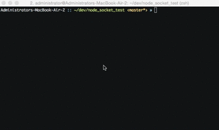
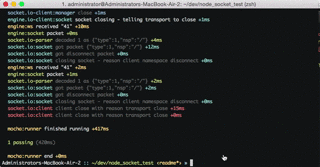

socket.io.tests
===============

Because the [Socket.io docs](http://socket.io/docs/logging-and-debugging/) don't contain any documentation on how to write unit or integration tests for apps that use the Socket.io; it can be really hard to get started. This repo contains a basic example of testing node.js apps that use socket.io using the [mocha](http://mochajs.org/) and [chai](http://chaijs.com/) testing frameworks.

To get started, clone this repo with:
```
git clone git@github.com:agconti/socket.io.tests.git
```
Install the required dependencies:
```
npm install
```
Run the testing suite with: 
```
npm test
```
You'll see something like this:



Want more information? Use the handy debug test command:

```
npm run debugTest
```


